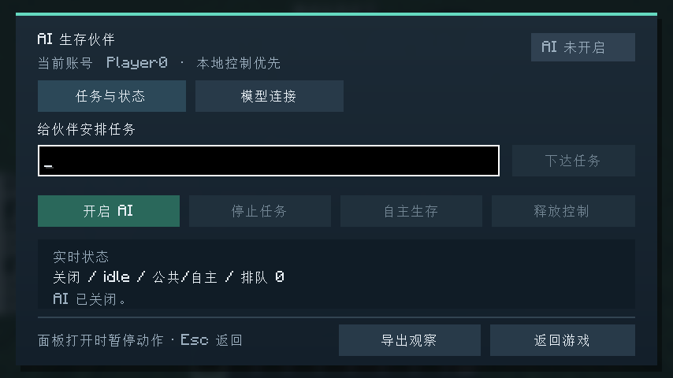
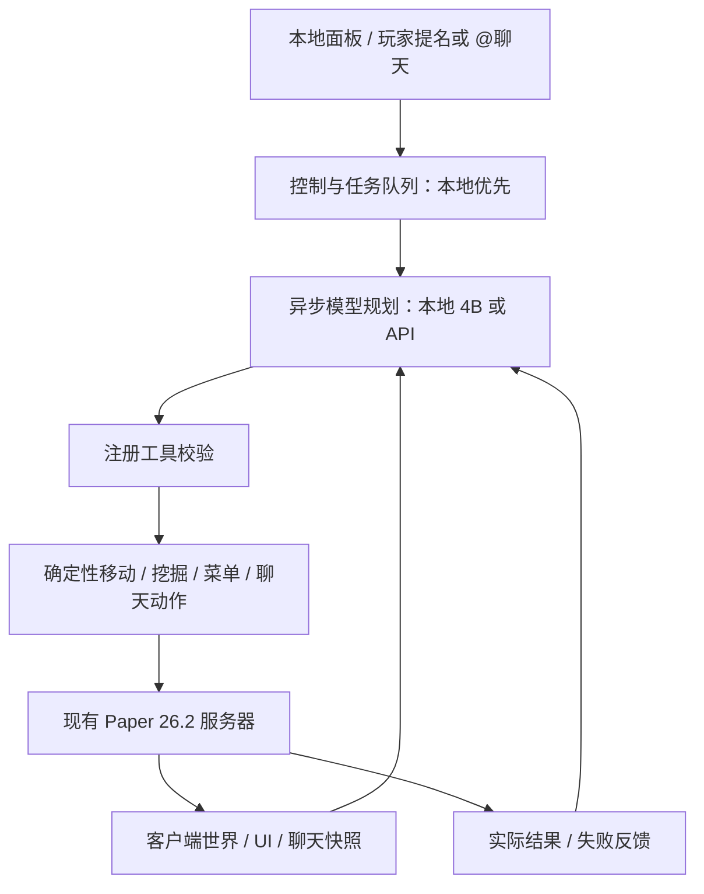

# MC AI Partner

Minecraft **26.2 / Fabric / Java 25** 纯客户端模组。服务器无需安装本项目插件。它控制安装模组的客户端当前登录账号；用户自己同时游玩时，另开不同账号的客户端。

## 安装与开启

1. 在 Fabric 26.2 客户端的 `mods` 文件夹放入 `mc-ai-partner-0.1.1.jar` 和 `fabric-api-0.161.0+26.2.jar`。
   桌面交付实例启用了 PCL 版本隔离，实际目录为 `C:\Users\Administrator\Desktop\MC-AI-Partner\客户端\.minecraft\versions\MC-AI-Partner-Fabric-26.2\mods`；该实例的配置位于同级 `config` 文件夹。启动配置名称不是独立游戏版本，AI 功能由 mod jar 提供。
2. 启动客户端并正常登录服务器，完成 AuthMe 等登录流程。
3. 首次启动生成 `config/mc-ai-partner.json`。默认模型端点是 `http://127.0.0.1:8080/v1`，模型名可修改。
4. 进入服务器后按 **F8** 打开面板，点击“开启 AI”；或输入 `/aip enable`。

退出服务器立即停止动作和模型请求，重新进服后需要重新开启。AI 默认自主生存；本地停止命令会同时暂停自主规划。



## 控制

| 命令 | 作用 |
|---|---|
| `/aip enable` / `/aip disable` | 开启/关闭 AI |
| `/aip stop` | 停止当前动作、任务和自主规划 |
| `/aip goal 收集附近的木材` | 下达本地优先任务 |
| `/aip collect minecraft:oak_log 16` | 采集新增 16 个原木，用背包稳定数量检查完成条件 |
| `/aip release` | 释放本地任务，处理排队的公共任务 |
| `/aip auto on` / `/aip auto off` | 开关自主规划 |
| `/aip status` | 查看状态 |
| `/aip inspect` | 导出 UI 与世界观察 JSON 到当前实例的 config 文件夹 |
| `/aip click 0 right` | 用最新 UI 状态正常点击槽位，支持 left/right/shift_left/shift_right |
| `/aip chatclick 1` | 执行观察中对应 ID 的聊天点击动作 |
| `/aip go 100 64 100` | 在已加载、安全地形和配置范围内尝试移动 |
| `/aip endpoint https://服务地址/v1` | 保存模型端点，随后重新开启 |
| `/aip model 模型名称` | 保存模型名称，随后重新开启 |
| `/aip keyenv MC_AI_API_KEY` | 指定保存 API key 的环境变量名称 |
| `/aip reload` | 重载配置 |

所有玩家可在服务器聊天中提到 AI 当前登录的玩家名或 **`@玩家名 <消息>`**，例如 `@AI_Partner 你好`、`AI_Partner 帮我收集木材`；也保留 **`!ai <任务>`**。AI 的自然语言回复通过当前玩家的正常聊天连接发送，服务器上的其他玩家可见；运行状态和错误只显示在本地。公共消息按任务队列处理，本地任务优先；本地任务期间会简短告知消息已排队。`!ai stop`、`@玩家名 停下` 可停止公共/自主任务，不能覆盖正在执行的本地任务。模型自己的聊天回声不会成为新指令。

## 模型配置

支持原生 function/tool calling 的 OpenAI 兼容服务。主机根地址、包含 `/v1` 等前缀的地址、完整 `/chat/completions` 地址均可使用。

API key 放在环境变量中，配置文件仅填写变量名。设置后需从能继承该环境变量的启动器启动客户端。不要将 key 填到 `apiKeyEnv` 字段本身。

模型每次规划最多发出三项注册动作，网络请求异步执行，正常移动与保命动作不会等待模型。默认规划间隔 8 秒，错误时退避；实际模型表现、任务成功率与延迟需要在选定后端上评估。

本地 GGUF 可用 `scripts/start-model.ps1 -ModelPath 'H:\实际模型路径.gguf'` 启动；省略路径时使用工程自带的 4B 文件。脚本不会结束其他模型服务。当前开发机已验证这份 4B 能通过本项目传输层返回正确的菜单槽位工具调用；内存较紧时需要使用较小的批次，这不代表持续游戏任务已通过模型验收。

启动脚本默认开启思考：`--reasoning on --reasoning-budget 256 --reasoning-format deepseek`，保留 32768 上下文。思考通过 `reasoning_content` 独立返回，模组发送到服务器的是正常回复与工具动作。可使用 `-Reasoning off` 关闭，或 `-ReasoningBudget 1024` 修改预算。默认响应预算为 1024 token，请求超时为 120 秒。

聊天中的 `/tpa`、`/tpaccept` 提示可被观察，`ui_input_chat` 可通过正常客户端接口发送命令。具体传送许可、冷却与结果由服务端现有插件决定；一般聊天建议不能越过本地控制优先级。

## 架构



具体类与验证边界见 [架构说明](docs/架构.md)。

## 0.1.1 修复

- 请求取消前先使回调版本失效，修复打开 F8 面板时把正常取消误报为 `CancellationException` 的问题。返回游戏后可继续规划。
- 提到当前玩家名或 `@玩家名` 可进入聊天，回复以正常玩家身份发到服务器。
- 思考模式默认开启，保留原模型与上下文配置；面板显示模型等待时间和最近错误。
- 面板拆分为任务状态与模型连接两页，可保存连接设置、使用 Enter 下达任务。

## 目前实现

- 进服后手动启用、断线停机、旧模型回复失效、本地优先与公共任务队列。
- 本地控制面板与 19 项注册工具；近距离安全寻路、跟随、挖掘、放置/交互、拾取、热栏选择、已有热栏食物进食、近战敌对生物攻击。
- 通用容器槽位、物品名称/Lore/Tooltip、模型数据、光标物品与 UI revision；左右键及 Shift 操作。
- 聊天组件点击/悬停、命令建议和输入；原生 Dialog 定义与标准控件操作。
- BossBar、ActionBar、Title/SubTitle、TAB、显示的计分板；可见方块与实体信息。
- 挖掘完成需要服务器方块更新；数量任务依据稳定背包数量检查。

## 验证边界

本项目已编译，并有本地 HTTP/控制状态测试和隔离真实客户端/服务器的 UI 测试。测试证明机制可以工作，不能替代用户正式服务器的 DeluxeMenus、QuickShop、TrChat、AuthMe、领地与反作弊组合验收。

导航目前限定近距离已加载地形，不会为走路自动拆建；长距离复杂地形、完整科技树、复杂建筑、持续自主生存的成功率仍需增强与验证。资源包图形的语义没有接入视觉模型；图标/字体/模型标识和文字数据会保留。复杂纯画布界面需要专门适配。通用自然语言任务结束由模型报告，尚不等同于全面自动验收；数量任务请优先使用 `/aip collect`。

## 构建

执行 `scripts/build.ps1`，产物位于 `build/libs`。需要 Java 25 和 Gradle 9.7.1。仓库带 Gradle wrapper；本机已下载的 Gradle 位于 `.tools/gradle-9.7.1`。参考源码和模型不打入模组。

```powershell
powershell -ExecutionPolicy Bypass -File .\scripts\build.ps1
```
